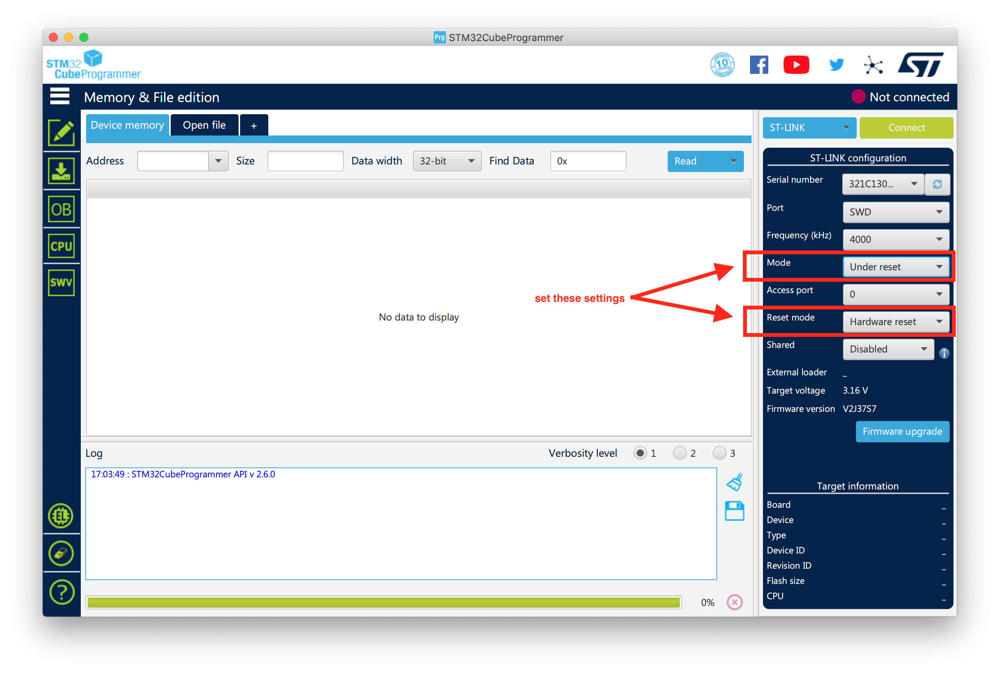
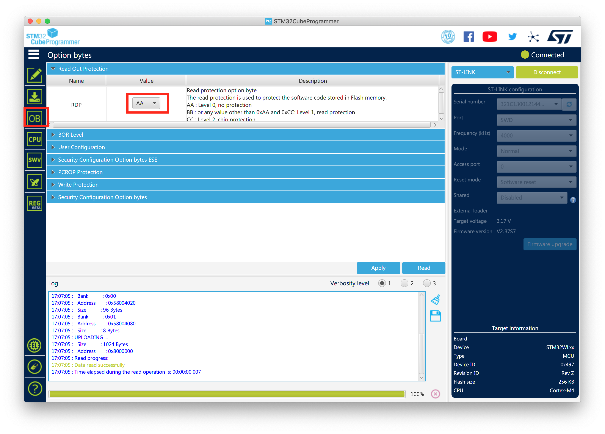

This repo contains a [breakout board](https://easyeda.com/vkbs/lora-e5-breakout-board) for the [LoRa E5](https://wiki.seeedstudio.com/LoRa-E5_STM32WLE5JC_Module/) module by seeedstudio.

It also has a collection of information concerning the module, specific installations and LoRaWAN stack.


The module comes with a serial LoRaWAN stack read protected level 1. If you want to load your code, you 1st must clear
the RDP (read out protection) in the option bytes.

1. Connect the breakout board with the stlink to your computer (SWDIO, GND, SWCLK, 3.3V, RST). Depenging on the stlink you use, you might need an external power source
3. Start [cubeProgrammer](https://www.st.com/en/development-tools/stm32cubeprog.html) and set the mode to "under reset" and reset mode to "hardware reset"
4. Try to connect to the device. If it doesn't work you might add a pulldown button on the reset pin and reset the module before connecting
5. Click on OB to clear the protection
6. Save
7. After this procedure, the code is lost and you can flash it with your own
8. You can change the settings back to mode "normal" and "software reset"




### tools
- [stlink command](https://github.com/stlink-org/stlink)
- [cubeProgrammer](https://www.st.com/en/development-tools/stm32cubeprog.html)
- [cubeIDE](https://www.st.com/en/development-tools/stm32cubeide.html)
- [openOCD](http://openocd.org/)

### hardware
- [stlink v2 from ali](https://www.aliexpress.com/item/32887597480.html?spm=a2g0s.9042311.0.0.4a594c4dR1TwNx)
- [stlink v3 from mouser](https://www.mouser.ch/ProductDetail/511-STLINK-V3MINI/)

- [LoRa-e5 product](https://wiki.seeedstudio.com/LoRa-E5_STM32WLE5JC_Module/)
- [LoRa-e5 datasheet](https://files.seeedstudio.com/products/317990687/res/LoRa-E5%20module%20datasheet_V1.0.pdf)
- [STM32WLE5JB datasheet](https://files.seeedstudio.com/products/317990687/res/STM32WLE5JC%20Datasheet.pdf) (32-bit Arm Cortex-M4, 256KB Flash, 64KB RAM, 150-960MHz)

### toolchain / software
- [lorawan stack](https://basicmac.io/)

### install cubeProgrammer, cubeIDE on mac (see [fix](https://community.st.com/s/question/0D50X0000BZFma4/stm32cubeide-wont-run-in-macos-1015-catalina))
```
cd ~/Downloads/en.stm32cubeprg-mac_v2-6-0 10.04.04
open SetupSTM32CubeProgrammer-2.6.0.app/Contents/MacOs/SetupSTM32CubeProgrammer-2_6_0_macos

sudo xattr -rd com.apple.quarantine /Applications/STM32CubeIDE.app
```


### toolchain (not working)
- [gcc download](https://developer.arm.com/tools-and-software/open-source-software/developer-tools/gnu-toolchain/gnu-rm)
- [homebrew installation](https://github.com/ARMmbed/homebrew-formulae)
```
brew tap ArmMbed/homebrew-formulae
brew install arm-none-eabi-gcc
```


### installation
- connect SWDIO, GND, SWCLK , 3.3V, reset
- 3.3V only needed if USB-C is *not* connected, don't connect both!
```
> brew install stlink
> brew-info --probe
Found 1 stlink programmers
 serial:     321c130012144d43574d4e00
 hla-serial: "\x32\x1c\x13\x00\x12\x14\x4d\x43\x57\x4d\x4e\x00"
 flash:      0 (pagesize: 0)
 sram:       0
 chipid:     0x0748
```
if you get errors with LIBUSB_ERROR_TIMEOUT, you need to upgrade your st-link programmer

### upgrade chinese programmer st-link v2
- install [st-link utility](https://www.st.com/en/development-tools/stsw-link004.html#get-software) on windows and 32bit [patch](https://community.st.com/s/question/0D53W00000Koh4BSAR/stlink-utility-upgrade-cannot-start-mfc140dll-not-found) to avoid error "missing mcf140.dll"
- connect st-link clone and update it to the latest version via the ST-LINK navigation entry 
- you should now be able to run ```st-info --probe```
